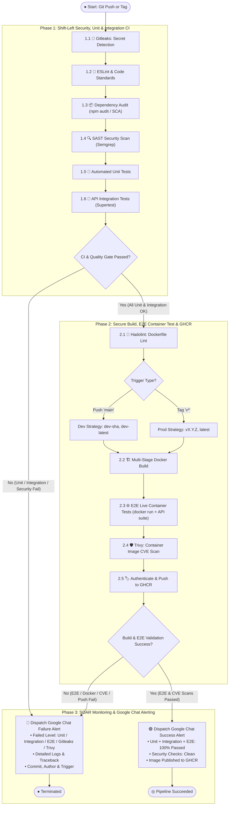

# 🚀 CI/CD & DevSecOps Pipeline (`ci-cd-kube`)

Enterprise Continuous Integration (CI) and Secure Containerization pipeline enforcing **Shift-Left DevSecOps quality gates** (Gitleaks, Linting, SCA, SAST, **Unit Tests**, **Integration Tests**, Hadolint, **E2E Container Tests**, Trivy CVE scan), versioned GHCR image publishing, and real-time Google Chat alerting.

---

## 📑 Architecture & UML Activity Diagram

For a complete breakdown and printable presentation view:
- 📖 **Architecture Document**: [docs/architecture/pipeline_architecture.md](docs/architecture/pipeline_architecture.md)
- 🖨️ **Printable / PDF Exportable HTML Diagram**: [docs/architecture/pipeline_diagram.html](docs/architecture/pipeline_diagram.html)

### 📊 DevSecOps & Testing Pyramid Workflow

---

## 🧪 Testing Pyramid Matrix

| Test Layer | Execution Phase | Scope | Framework |
|---|---|---|---|
| **1. 🧪 Unit Tests** | Phase 1 (Pre-Build) | Isolated functions and core business logic. | Jest |
| **2. 🔄 Integration Tests** | Phase 1 (Pre-Build) | HTTP routes (`/`, `/healthz`), headers, middleware. | Supertest / Jest |
| **3. 🌐 E2E Container Tests** | Phase 2 (Post-Build) | Spins up the container image (`docker run`) and validates live HTTP responses. | Automated Runner / curl |

---

## 🎯 Image Versioning Strategy

| Git Trigger | Target Git Ref | Generated Image Tag(s) | Target Environment |
|---|---|---|---|
| **Branch Push** | `refs/heads/main` | `ghcr.io/<owner>/ci-cd-kube:dev-<sha>` `ghcr.io/<owner>/ci-cd-kube:dev-latest` | **Development** |
| **Git Tag** | `refs/tags/v*` (e.g. `v1.0.0`) | `ghcr.io/<owner>/ci-cd-kube:1.0.0` `ghcr.io/<owner>/ci-cd-kube:latest` | **Production** |

---

## 📋 Implementation Roadmap & Kanban Board
Track project progress on the [GitHub Project Kanban Board](https://github.com/users/konstantine-garozashvili/projects/21).
