# 🚀 CI/CD Pipeline & Kubernetes Deployment (`ci-cd-kube`)

Comprehensive Continuous Integration (CI) and Continuous Deployment (CD) pipeline automating code quality gates, container builds, versioned registry publishing, Kubernetes cluster deployment, and real-time Google Chat alerting.

---

## 📑 Architecture & UML Activity Diagram

For a complete breakdown and printable presentation view:
- 📖 **Architecture Document**: [docs/architecture/pipeline_architecture.md](docs/architecture/pipeline_architecture.md)
- 🖨️ **Printable / PDF Exportable HTML Diagram (Landscape)**: [docs/architecture/pipeline_diagram.html](docs/architecture/pipeline_diagram.html)

### 📊 Pipeline Workflow (Landscape Flow)

```mermaid
flowchart LR
    %% Global Styling Classes
    classDef startEnd fill:#1e293b,stroke:#0ea5e9,stroke-width:2.5px,color:#f8fafc,font-weight:bold;
    classDef action fill:#0f172a,stroke:#38bdf8,stroke-width:1.5px,color:#e2e8f0;
    classDef decision fill:#312e81,stroke:#818cf8,stroke-width:2px,color:#ffffff,font-weight:bold;
    classDef fail fill:#450a0a,stroke:#ef4444,stroke-width:2px,color:#fee2e2;
    classDef success fill:#052e16,stroke:#22c55e,stroke-width:2px,color:#dcfce7;
    classDef branch fill:#172554,stroke:#60a5fa,stroke-width:1.5px,color:#dbeafe;

    %% Entry Node
    StartNode((● Start)):::startEnd --> Trigger[Event: Git Push 'main'<br/>OR Tag 'v*']:::action
    Trigger --> GHATrigger[GitHub Actions<br/>Runner Triggered]:::action

    %% Stage 1: CI & Quality Gate
    subgraph STAGE_1 ["Stage 1: CI & Quality Gate"]
        direction TB
        GHATrigger --> Checkout[1.1 Checkout Code<br/>actions/checkout@v4]:::action
        Checkout --> SetupEnv[1.2 Setup Runtime &<br/>Cache Dependencies]:::action
        SetupEnv --> InstallDeps[1.3 Install Dependencies<br/>npm ci]:::action
        InstallDeps --> RunTests[1.4 Execute Test Suite<br/>npm test]:::action
        RunTests --> TestDecision{Tests<br/>Passed?}:::decision
    end

    %% Stage 2 & 3: Containerization & Registry Push
    subgraph STAGE_2_3 ["Stage 2 & 3: Container Build & GHCR Push"]
        direction TB
        Stage2Entry[Enter Build Stage]:::action --> CheckTriggerType{Trigger<br/>Type?}:::decision
        CheckTriggerType -- "Push 'main'" --> DevTagging["Dev Strategy<br/>• dev-&lt;sha&gt;<br/>• dev-latest"]:::branch
        CheckTriggerType -- "Tag 'v*'" --> ProdTagging["Prod Strategy<br/>• &lt;vX.Y.Z&gt;<br/>• latest"]:::branch
        DevTagging --> SetupBuildx[Setup Docker Buildx & Cache]:::action
        ProdTagging --> SetupBuildx
        SetupBuildx --> AuthGHCR[Auth GHCR via GITHUB_TOKEN]:::action
        AuthGHCR --> DockerBuildPush[Build Multi-Stage Image & Push]:::action
        DockerBuildPush --> BuildDecision{Build & Push<br/>Succeeded?}:::decision
    end

    %% Stage 4: Kubernetes CD
    subgraph STAGE_4 ["Stage 4: Kubernetes Deployment (CD)"]
        direction TB
        Stage4Entry[Enter Deploy Stage]:::action --> AuthK8s[Authenticate Cluster<br/>via KUBECONFIG]:::action
        AuthK8s --> ApplyManifests[Apply Manifests<br/>Deploy / Svc / Ingress]:::action
        ApplyManifests --> SetImage[Update Deployment Image Tag]:::action
        SetImage --> RolloutWait[Wait for Rollout Status<br/>timeout: 120s]:::action
        RolloutWait --> RolloutDecision{Rollout<br/>Healthy?}:::decision
    end

    %% Stage 5: Notification & Completion
    subgraph STAGE_5 ["Stage 5: Notification & Terminal States"]
        direction TB
        PrepareFail[Extract Error Logs & Failure Context]:::fail --> SendFailNotif[Send Google Chat Failure Card 🔴]:::fail
        SendFailNotif --> EndFail((● Terminated)):::fail

        PrepareSuccess[Compile Metrics, Digest & URL]:::success --> SendSuccessNotif[Send Google Chat Success Card 🟢]:::success
        SendSuccessNotif --> EndSuccess((◎ Success)):::startEnd
    end

    %% Flow Connections & Decisions
    TestDecision -- "✅ Yes" --> Stage2Entry
    TestDecision -- "❌ No (Fail-Fast)" --> PrepareFail

    BuildDecision -- "✅ Yes" --> Stage4Entry
    BuildDecision -- "❌ No" --> PrepareFail

    RolloutDecision -- "✅ Yes" --> PrepareSuccess
    RolloutDecision -- "❌ No" --> PrepareFail
```

---

## 🎯 Image Versioning Strategy

| Git Trigger | Target Git Ref | Generated Image Tag(s) | Target Environment |
|---|---|---|---|
| **Branch Push** | `refs/heads/main` | `ghcr.io/<owner>/ci-cd-kube:dev-<sha>` `ghcr.io/<owner>/ci-cd-kube:dev-latest` | **Development** |
| **Git Tag** | `refs/tags/v*` (e.g. `v1.0.0`) | `ghcr.io/<owner>/ci-cd-kube:1.0.0` `ghcr.io/<owner>/ci-cd-kube:latest` | **Production** |

---

## 📋 Implementation Roadmap & Kanban Board
Track project progress on the [GitHub Project Kanban Board](https://github.com/users/konstantine-garozashvili/projects/21).
