# 🚀 CI/CD & DevSecOps Pipeline (`ci-cd-kube`)

Enterprise Continuous Integration (CI) and Secure Containerization pipeline enforcing **Shift-Left DevSecOps quality gates** (actions/checkout@v4, Gitleaks, actions/setup-node@v4, npm ci, ESLint, npm audit, Semgrep SAST, **Unit Tests**, **Integration Tests**, **Playwright E2E Tests**, Hadolint, Trivy CVE scan), versioned GHCR image publishing, and real-time Google Chat alerting.

---

## 📑 Architecture & UML Activity Diagram

For a complete breakdown and printable presentation view:
- 📖 **Architecture Document**: [docs/architecture/pipeline_architecture.md](docs/architecture/pipeline_architecture.md)
- 🖨️ **Printable / PDF Exportable HTML Diagram**: [docs/architecture/pipeline_diagram.html](docs/architecture/pipeline_diagram.html)

### 📊 Master Pipeline Workflow (Chronological Sequence)

```mermaid
flowchart TD
    StartNode(["● Start: Git Push or Tag"]) --> GHATrigger["Trigger GitHub Actions Runner"]

    subgraph PHASE1 ["Phase 1: Environment Setup, Security & Full Testing Gate (CI)"]
        GHATrigger --> Checkout["1.1 📥 Checkout Code (actions/checkout@v4, fetch-depth: 0)"]
        Checkout --> SecretGate["1.2 🔑 Gitleaks: Scan Commits for Exposed Secrets & Keys"]
        SecretGate --> SetupNode["1.3 ⚙️ Setup Node.js & Cache (actions/setup-node@v4)"]
        SetupNode --> InstallDeps["1.4 📦 Install Clean Dependencies (npm ci)"]
        InstallDeps --> Lint["1.5 🧹 ESLint: Code Standards & Formatting"]
        Lint --> DepAudit["1.6 🛡️ SCA: Dependency Vulnerability Audit (npm audit)"]
        DepAudit --> SAST["1.7 🔍 SAST: Static Code Security Analysis (Semgrep)"]
        SAST --> UnitTests["1.8 🧪 Unit Tests: Pure Functions & Logic (Jest)"]
        UnitTests --> IntegrationTests["1.9 🔄 Integration Tests: HTTP Routes & APIs (Supertest)"]
        IntegrationTests --> PlaywrightE2E["1.10 🎭 Playwright E2E: Headless Browser Scenarios"]
        PlaywrightE2E --> Phase1Dec{"All CI Steps Passed?"}
    end

    subgraph PHASE2 ["Phase 2: Secure Docker Build & GHCR Publishing"]
        Hadolint["2.1 🐳 Hadolint: Dockerfile Security & Best Practice Lint"]
        Hadolint --> SetupBuildx["2.2 🛠️ Setup Docker Buildx & Cache Engine"]
        SetupBuildx --> CheckTrigger{"Trigger Type?"}
        CheckTrigger -->|"Push 'main'"| DevTag["Dev Strategy: dev-sha, dev-latest"]
        CheckTrigger -->|"Tag 'v*'"| ProdTag["Prod Strategy: vX.Y.Z, latest"]
        DevTag --> DockerBuild["2.3 🏗️ Multi-Stage Docker Image Build"]
        ProdTag --> DockerBuild
        DockerBuild --> TrivyScan["2.4 🛡️ Trivy: Container Image CVE Scan"]
        TrivyScan --> PushGHCR["2.5 🏷️ Authenticate with GITHUB_TOKEN & Push to GHCR"]
        PushGHCR --> Phase2Dec{"Build & Push Succeeded?"}
    end

    subgraph PHASE3 ["Phase 3: SOAR Monitoring & Google Chat Alerting"]
        FailAlert["🔴 Dispatch Google Chat Failure Alert<br/>• Exact Offending Step: Gitleaks / Lint / Unit / Integ / Playwright / Hadolint / Trivy<br/>• Failure Logs & Traceback<br/>• Commit SHA, Author & Branch/Tag"] --> TermFail(["● Terminated"])
        SuccAlert["🟢 Dispatch Google Chat Success Alert<br/>• All 10 CI Gates & Tests: 100% Passed<br/>• Image Published to GHCR with Verified Tags<br/>• Commit SHA, Author & Run Link"] --> TermSucc(["◎ Pipeline Succeeded"])
    end

    %% Success Transitions
    Phase1Dec -->|"Yes (All 10 CI Gates Clean)"| Hadolint
    Phase2Dec -->|"Yes (Zero High CVEs & Pushed)"| SuccAlert

    %% Fail-Fast Transitions (Immediate Alert & Terminate)
    Phase1Dec -->|"No (Any Security, Lint, or Test Failure)"| FailAlert
    Phase2Dec -->|"No (Dockerfile Lint, Image CVE, or Push Failure)"| FailAlert
```

---

## 🎯 Image Versioning Strategy

| Git Trigger | Target Git Ref | Generated Image Tag(s) | Target Environment |
|---|---|---|---|
| **Branch Push** | `refs/heads/main` | `ghcr.io/<owner>/ci-cd-kube:dev-<sha>` `ghcr.io/<owner>/ci-cd-kube:dev-latest` | **Development** |
| **Git Tag** | `refs/tags/v*` (e.g. `v1.0.0`) | `ghcr.io/<owner>/ci-cd-kube:1.0.0` `ghcr.io/<owner>/ci-cd-kube:latest` | **Production** |

---

## 📋 Implementation Roadmap & Kanban Board
Track project progress on the [GitHub Project Kanban Board](https://github.com/users/konstantine-garozashvili/projects/21).
