# 🚀 DevSecOps Golden Starter & Cloud-Native Framework (`ci-cd-kube`)


Enterprise **DevSecOps Golden Template** & dynamic scaffolding engine designed to bootstrap any new startup project with **Shift-Left security gates**, **3-tier testing (Jest, Supertest, Playwright)**, **OWASP SAST & DAST**, **Docker multi-stage containerization**, and automated **GHCR registry publishing** from Day 1.

---

## ⚡ Quick Start: Interactive Project Wizard

When cloning this template to start a new project, run the interactive CLI wizard:

```bash
npm run init
```

```text
┌──────────────────────────────────────────────────────────────────┐
│  🚀 DEVSECOPS GOLDEN STARTER — Dynamic Project Scaffolder        │
│  Enterprise Shift-Left Security, CI/CD & Testing Boilerplate     │
└──────────────────────────────────────────────────────────────────┘

? Project Name: my-saas-app
? Choose Framework:
  ● Express.js   (Battle-tested, lightweight, minimal)
  ○ Hono         (Ultrafast, modern Web Standards, TypeScript-first)
  ○ NestJS       (Enterprise architecture, TypeScript, modular)
  ○ Next.js      (Fullstack React, App Router, SSR & APIs)

? Choose Database:
  ● PostgreSQL   (Prisma ORM + CI Test Service Container)
  ○ MongoDB      (Mongoose / Mongo CI Service)
  ○ None         (Stateless / In-memory)

⚙️ Generating customized boilerplate...
  ✔ Generated tailored .github/workflows/ci-cd.yml
  ✔ Generated optimized multi-stage Dockerfile
  ✔ Configured database test services in CI
```

---

## 📊 Live DevSecOps CI/CD Workflow

```mermaid
flowchart TD
    StartNode(["● Start: Git Push or Tag"]) --> GHATrigger["Trigger GitHub Actions Runner"]

    subgraph PHASE1 ["Phase 1: Environment Setup, Shift-Left Security & Testing Gate (CI)"]
        GHATrigger --> Checkout["1.1 📥 Checkout Code (actions/checkout@v4, fetch-depth: 0)"]
        Checkout --> SecretGate["1.2 🔑 Gitleaks: Scan Commits for Exposed Secrets & Keys"]
        SecretGate --> SetupNode["1.3 ⚙️ Setup Node.js & Cache (actions/setup-node@v4)"]
        SetupNode --> InstallDeps["1.4 📦 Install Clean Dependencies (npm ci)"]
        InstallDeps --> Lint["1.5 🧹 ESLint: Code Standards & Formatting"]
        Lint --> DepAudit["1.6 🛡️ SCA: Dependency Vulnerability Audit (npm audit)"]
        DepAudit --> SAST["1.7 🔍 SAST: Semgrep OWASP Top-10 Security Scan"]
        SAST --> UnitTests["1.8 🧪 Unit Tests: Pure Functions & Logic (Jest)"]
        UnitTests --> IntegrationTests["1.9 🔄 Integration Tests: HTTP Routes & APIs (Supertest)"]
        IntegrationTests --> PlaywrightE2E["1.10 🎭 Playwright E2E: Headless Browser Scenarios"]
        PlaywrightE2E --> OWASPZAP["1.11 ⚡ OWASP ZAP DAST: Live Vulnerability & Header Scan (zaproxy)"]
        OWASPZAP --> Phase1Dec{"All CI & OWASP Gates Passed?"}
    end

    subgraph PHASE2 ["Phase 2: Secure Docker Build & GHCR Publishing"]
        Hadolint["2.1 🐳 Hadolint: Dockerfile Security & Best Practice Lint"]
        Hadolint --> SetupBuildx["2.2 🛠️ Setup Docker Buildx & Cache Engine"]
        SetupBuildx --> CheckTrigger{"Trigger Type?"}
        CheckTrigger -->|"Push 'main'"| DevTag["Dev Strategy: dev-sha, dev-latest"]
        CheckTrigger -->|"Tag 'v*'"| ProdTag["Prod Strategy: vX.Y.Z, latest"]
        DevTag --> DockerBuild["2.3 🏗️ Multi-Stage Docker Image Build"]
        ProdTag --> DockerBuild
        DockerBuild --> TrivyScan["2.4 🛡️ Trivy: Container Image CVE Scan"]
        TrivyScan --> PushGHCR["2.5 🏷️ Authenticate with GITHUB_TOKEN & Push to GHCR"]
        PushGHCR --> Phase2Dec{"Build & Push Succeeded?"}
    end

    subgraph PHASE3 ["Phase 3: SOAR Monitoring & Google Chat Alerting"]
        FailAlert["🔴 Dispatch Google Chat Failure Alert<br/>• Exact Offending Step: Gitleaks / Lint / OWASP / Unit / Integ / Playwright / Trivy<br/>• Failure Logs & Traceback<br/>• Commit SHA, Author & Branch/Tag"] --> TermFail(["● Terminated"])
        SuccAlert["🟢 Dispatch Google Chat Success Alert<br/>• All 11 CI & OWASP Gates: 100% Passed<br/>• Image Published to GHCR with Verified Tags<br/>• Commit SHA, Author & Run Link"] --> TermSucc(["◎ Pipeline Succeeded"])
    end

    %% Success Transitions
    Phase1Dec -->|"Yes (All 11 CI Gates Clean)"| Hadolint
    Phase2Dec -->|"Yes (Zero High CVEs & Pushed)"| SuccAlert

    %% Fail-Fast Transitions (Immediate Alert & Terminate)
    Phase1Dec -->|"No (Any Security, OWASP, Lint, or Test Failure)"| FailAlert
    Phase2Dec -->|"No (Dockerfile Lint, Image CVE, or Push Failure)"| FailAlert
```



---

## 🛠️ Local Developer Commands

| Command | Purpose |
|---|---|
| `npm run dev` | Starts local development server with hot-reload on `http://localhost:3000` |
| `npm run lint` | Validates code standards & formatting via ESLint |
| `npm test` | Executes both **Jest Unit** and **Supertest Integration** test suites |
| `npm run test:unit` | Executes pure logic unit tests in isolation |
| `npm run test:integration` | Executes HTTP route, healthcheck, and security header tests |
| `npm run test:e2e` | Launches **Playwright** headless browser for end-to-end user journeys |
| `npm run scan:secrets` | Runs **Gitleaks** locally to detect secret leaks before committing |
| `npm run scan:sast` | Runs **Semgrep OWASP Top-10** security analysis locally |
| `npm run init` | Launches interactive project scaffolder CLI |

---

## 🎯 Container Versioning & Registry (GHCR)

| Git Trigger | Target Git Ref | Published Image Tag(s) | Environment |
|---|---|---|---|
| **Branch Push** | `refs/heads/main` | `ghcr.io/<owner>/ci-cd-kube:dev-<sha>`<br/>`ghcr.io/<owner>/ci-cd-kube:dev-latest` | **Development** |
| **Release Tag** | `refs/tags/v*` (e.g. `v1.0.0`) | `ghcr.io/<owner>/ci-cd-kube:1.0.0`<br/>`ghcr.io/<owner>/ci-cd-kube:latest` | **Production** |

---

## 📋 Architecture & Documentation
- 📖 [Pipeline Architectural Specification](docs/architecture/pipeline_architecture.md)
- 🖨️ [Printable / PDF Exportable HTML Diagram](docs/architecture/pipeline_diagram.html)
- 📋 [GitHub Project Kanban Board](https://github.com/users/konstantine-garozashvili/projects/21)
