# 🏗️ CI/CD Pipeline Architecture & UML Activity Diagram

## 📌 Overview
This document specifies the technical architecture and workflow logic of the **Continuous Integration (CI) and Continuous Deployment (CD)** pipeline for the `ci-cd-kube` project. The automated pipeline is powered by **GitHub Actions**, containerized with **Docker**, stored in **GitHub Container Registry (GHCR)**, deployed to **Kubernetes**, and monitored with automated **Google Chat** notifications.

---

## 📊 UML Activity Diagram (Landscape Flow)

The diagram below presents the end-to-end execution workflow structured in a horizontal landscape sequence from initial Git trigger to Kubernetes rollout and Google Chat alerting.

```mermaid
flowchart LR
    %% Global Styling Classes
    classDef startEnd fill:#1e293b,stroke:#0ea5e9,stroke-width:2.5px,color:#f8fafc,font-weight:bold;
    classDef action fill:#0f172a,stroke:#38bdf8,stroke-width:1.5px,color:#e2e8f0;
    classDef decision fill:#312e81,stroke:#818cf8,stroke-width:2px,color:#ffffff,font-weight:bold;
    classDef fail fill:#450a0a,stroke:#ef4444,stroke-width:2px,color:#fee2e2;
    classDef success fill:#052e16,stroke:#22c55e,stroke-width:2px,color:#dcfce7;
    classDef branch fill:#172554,stroke:#60a5fa,stroke-width:1.5px,color:#dbeafe;

    %% Entry Node
    StartNode((● Start)):::startEnd --> Trigger[Event: Git Push 'main'<br/>OR Tag 'v*']:::action
    Trigger --> GHATrigger[GitHub Actions<br/>Runner Triggered]:::action

    %% Stage 1: CI & Quality Gate
    subgraph STAGE_1 ["Stage 1: CI & Quality Gate"]
        direction TB
        GHATrigger --> Checkout[1.1 Checkout Code<br/>actions/checkout@v4]:::action
        Checkout --> SetupEnv[1.2 Setup Runtime &<br/>Cache Dependencies]:::action
        SetupEnv --> InstallDeps[1.3 Install Dependencies<br/>npm ci]:::action
        InstallDeps --> RunTests[1.4 Execute Test Suite<br/>npm test]:::action
        RunTests --> TestDecision{Tests<br/>Passed?}:::decision
    end

    %% Stage 2 & 3: Containerization & Registry Push
    subgraph STAGE_2_3 ["Stage 2 & 3: Container Build & GHCR Push"]
        direction TB
        Stage2Entry[Enter Build Stage]:::action --> CheckTriggerType{Trigger<br/>Type?}:::decision
        CheckTriggerType -- "Push 'main'" --> DevTagging["Dev Strategy<br/>• dev-&lt;sha&gt;<br/>• dev-latest"]:::branch
        CheckTriggerType -- "Tag 'v*'" --> ProdTagging["Prod Strategy<br/>• &lt;vX.Y.Z&gt;<br/>• latest"]:::branch
        DevTagging --> SetupBuildx[Setup Docker Buildx & Cache]:::action
        ProdTagging --> SetupBuildx
        SetupBuildx --> AuthGHCR[Auth GHCR via GITHUB_TOKEN]:::action
        AuthGHCR --> DockerBuildPush[Build Multi-Stage Image & Push]:::action
        DockerBuildPush --> BuildDecision{Build & Push<br/>Succeeded?}:::decision
    end

    %% Stage 4: Kubernetes CD
    subgraph STAGE_4 ["Stage 4: Kubernetes Deployment (CD)"]
        direction TB
        Stage4Entry[Enter Deploy Stage]:::action --> AuthK8s[Authenticate Cluster<br/>via KUBECONFIG]:::action
        AuthK8s --> ApplyManifests[Apply Manifests<br/>Deploy / Svc / Ingress]:::action
        ApplyManifests --> SetImage[Update Deployment Image Tag]:::action
        SetImage --> RolloutWait[Wait for Rollout Status<br/>timeout: 120s]:::action
        RolloutWait --> RolloutDecision{Rollout<br/>Healthy?}:::decision
    end

    %% Stage 5: Notification & Completion
    subgraph STAGE_5 ["Stage 5: Notification & Terminal States"]
        direction TB
        PrepareFail[Extract Error Logs & Failure Context]:::fail --> SendFailNotif[Send Google Chat Failure Card 🔴]:::fail
        SendFailNotif --> EndFail((● Terminated)):::fail

        PrepareSuccess[Compile Metrics, Digest & URL]:::success --> SendSuccessNotif[Send Google Chat Success Card 🟢]:::success
        SendSuccessNotif --> EndSuccess((◎ Success)):::startEnd
    end

    %% Flow Connections & Decisions
    TestDecision -- "✅ Yes" --> Stage2Entry
    TestDecision -- "❌ No (Fail-Fast)" --> PrepareFail

    BuildDecision -- "✅ Yes" --> Stage4Entry
    BuildDecision -- "❌ No" --> PrepareFail

    RolloutDecision -- "✅ Yes" --> PrepareSuccess
    RolloutDecision -- "❌ No" --> PrepareFail
```

---

## 🔄 Detailed Pipeline Stages & Logic

### 1. Triggers & Event Filtering
| Trigger Event | Git Ref | Target Image Tags | Environment Target |
|---|---|---|---|
| **Code Push** | `refs/heads/main` | `ghcr.io/.../app:dev-<sha>`, `ghcr.io/.../app:dev-latest` | `development` |
| **Release Tag** | `refs/tags/v*` (e.g. `v1.0.0`) | `ghcr.io/.../app:1.0.0`, `ghcr.io/.../app:latest` | `production` |

---

### 2. Stage-by-Stage Breakdown

#### **Stage 1: Checkout & Automated Testing (CI Quality Gate)**
- **Fail-Fast Mechanism**: If any unit/integration test fails, execution halts immediately with exit code `1`.
- Subsequent build and deploy jobs are skipped.
- An alert is immediately prepared for dispatch.

#### **Stage 2: Containerization & Registry Push**
- Multi-stage `Dockerfile` ensures the production runtime container contains only compiled production assets and no dev-dependencies.
- GitHub Actions cache (`type=gha`) accelerates layer builds.
- Authentication against GitHub Container Registry (`ghcr.io`) utilizes GitHub's native scoped `GITHUB_TOKEN`.

#### **Stage 3: Kubernetes Continuous Deployment (CD)**
- Cluster authentication using secured `KUBECONFIG` secret.
- Application manifests deployed:
  - `Deployment`: Manages pod replicas, zero-downtime rolling updates, resource requests/limits, and health probes (`livenessProbe`, `readinessProbe`).
  - `Service`: Exposes pods internally within cluster (`ClusterIP`).
  - `Ingress`: Routes HTTP traffic from external ingress controller.
  - `ConfigMap` / `Secret`: Injects environment variables.
- Verification command: `kubectl rollout status deployment/ci-cd-kube-app --timeout=120s`.

#### **Stage 4: Google Chat Webhook Alerting**
- Executed on `if: always()` condition to guarantee dispatch regardless of job status.
- **Success Card (🟢)**: Includes Commit SHA, author name, branch/tag name, image digest, deployed namespace, and link to workflow run.
- **Failure Card (🔴)**: Highlights the specific stage that broke (Tests, Docker, K8s), error log extract, author to notify, and workflow link for immediate triage.

---

## 🛡️ SOAR & Resilience Principles Applied
1. **Automated Rollback Safeguard**: If `kubectl rollout status` fails within the 120s window, Kubernetes maintains traffic on previous healthy pods.
2. **Immutable Artifacts**: Production container tags match explicit SemVer Git tags (`v1.0.0`), guaranteeing reproducibility.
3. **Secret Isolation**: Sensitive credentials (`KUBECONFIG`, `GOOGLE_CHAT_WEBHOOK_URL`) are isolated within GitHub Actions Secrets and masked from console output.
