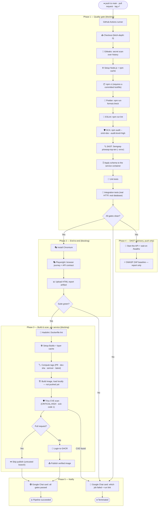

# 🏗️ CI/CD & DevSecOps Pipeline Architecture

## 📌 Overview

This document specifies the pipeline that `laplateforme-starter` generates into
every scaffolded project at `.github/workflows/ci-cd.yml`.

The pipeline enforces shift-left security, the full testing pyramid (unit,
integration, Playwright end-to-end), OWASP gates (Semgrep SAST and ZAP DAST),
multi-stage container builds, Trivy CVE scanning, GHCR publication and Google
Chat alerting.

Two design rules govern it:

1. **Pull requests are gated.** A quality gate that only runs after merge is not
   a gate. Every job below runs on `pull_request` as well as `push`.
2. **Gates that claim to block, block.** Steps that are advisory say so
   explicitly rather than passing quietly with `exit-code: 0`. Today the only
   advisory step is the ZAP baseline, which reports findings that are expected
   on a fresh project.

---

## 📊 Pipeline flow



---

## 🛡️ The security stack

| Layer          | Tool                      | Type            | Blocking    | What it protects                                                                                                                                    |
| -------------- | ------------------------- | --------------- | ----------- | --------------------------------------------------------------------------------------------------------------------------------------------------- |
| **Secrets**    | Gitleaks                  | History scan    | ✅          | Tokens, keys and credentials committed by accident. Also runs as a pre-commit hook locally.                                                         |
| **SAST**       | Semgrep `p/owasp-top-ten` | White-box       | ✅          | Injection, unsafe deserialisation, hardcoded secrets, weak crypto in your own source.                                                               |
| **SCA**        | `npm audit --omit=dev`    | Dependency scan | ✅          | Known CVEs in packages that actually ship. Dev-only advisories are reported but do not block, because they cannot be exploited in production.       |
| **Container**  | Trivy                     | Image scan      | ✅          | OS and library CVEs in the built image, scanned **before** publication. `ignore-unfixed` skips advisories with no available patch.                  |
| **Dockerfile** | Hadolint                  | Lint            | ✅          | Missing non-root user, unpinned bases, instruction-order mistakes.                                                                                  |
| **DAST**       | OWASP ZAP baseline        | Black-box       | ⚠️ advisory | Missing security headers, cookie flags, CORS misconfiguration on the live app. Read the artifact — a green tick here is not a clean bill of health. |

To accept a specific Trivy finding, add it to a `.trivyignore` file. Do not
disable the gate.

---

## 📋 Job breakdown

### Phase 1 — `quality-gate`

Runs a database service container (`postgres:16-alpine` or `mongo:7-jammy`)
when the project uses one, so integration tests exercise a real driver rather
than a mock.

1. `actions/checkout@v4` with `fetch-depth: 0`, which Gitleaks needs to scan history.
2. **Gitleaks** over the commits in this push or pull request.
3. `actions/setup-node@v4` with npm caching.
4. `npm ci` — requires `package-lock.json` to be committed. It is deliberately
   **not** gitignored in generated projects.
5. `npm run format:check` — Prettier.
6. `npm run lint` — ESLint across every workspace.
7. `npm audit --omit=dev --audit-level=high`.
8. `semgrep scan --config="p/owasp-top-ten" --error`.
9. Schema application, then unit and integration tests.

### Phase 2 — `e2e`

Playwright starts the application itself through its `webServer` config, so the
suite works from a clean checkout. It runs two specs:

- **`app.spec.js`** — browser journey through the landing page.
- **`api.spec.js`** — API contract, driven through the frontend origin so the
  run also proves the same-origin proxy is wired correctly.

The HTML report uploads as an artifact whenever the job is not cancelled.

### Phase 3 — `docker`

A matrix job, one leg per service the project generates (backend, and frontend
when there is one).

- Images build with `load: true` and are **not** pushed yet.
- Trivy scans the local image. Publishing an image and _then_ scanning it is
  backwards, so the order here is build → scan → push.
- Publication is skipped entirely on pull requests: the branch is untrusted and
  `GITHUB_TOKEN` is read-only there anyway.

Tagging strategy:

| Trigger        | Tags                      |
| -------------- | ------------------------- |
| Pull request   | `pr-<number>`             |
| Push to `main` | `dev-<sha>`, `dev-latest` |
| Tag `v*`       | `X.Y.Z`, `latest`         |

### Phase 4 — `dast`

Push-only. Boots the API, waits on `/healthz`, then runs the ZAP baseline in
report-only mode.

### Phase 5 — `notify`

Runs `if: always()` on pushes. The webhook is read from
`secrets.GOOGLE_CHAT_WEBHOOK_URL` and checked **inside** the script rather than
in an `if:` expression — a step's own `env:` block is not visible to its own
`if:`, so guarding that way would silently never run.

The card payload is assembled with `jq`, so branch names and commit metadata
cannot break out of the JSON strings they are placed in.

Without the secret configured, the step logs a note explaining how to add it
and passes.

---

## 🐳 Container design

Both images are built from the **repository root** with an explicit `-f` path.
This is required, not stylistic: npm workspaces keep a single lockfile at the
root, and `npm ci` cannot run without it.

```bash
docker build -f backend/Dockerfile -t app-backend .
```

The backend image installs the **full** dependency tree, runs the build and any
`postinstall` code generation (Prisma's client), then removes dev dependencies
with `npm prune --omit=dev`. Installing with `npm ci --omit=dev` up front would
fail before code generation could run.

Both images:

- run as the non-root `node` user,
- use multi-stage builds so no build toolchain reaches production,
- declare a `HEALTHCHECK` that hits `/healthz`,
- use `tini` as PID 1 so `SIGTERM` reaches Node and shutdown stays graceful.

---

## 🩺 Health probe contract

| Endpoint       | Question              | Behaviour                                                                                                                                           |
| -------------- | --------------------- | --------------------------------------------------------------------------------------------------------------------------------------------------- |
| `GET /healthz` | Is the process alive? | Always 200 while running. Checks **no** dependencies — a liveness probe that fails on a database blip makes Kubernetes restart a healthy container. |
| `GET /ready`   | Can it serve traffic? | Checks the database and returns **503** when it cannot, so the load balancer drains this instance instead of sending it live traffic.               |
| `GET /live`    | Cheap ping            | Plaintext `OK` for uptime monitors.                                                                                                                 |
