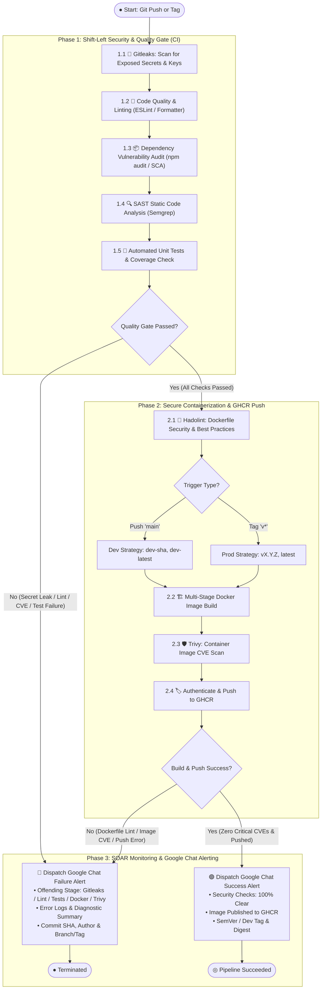

# 🏗️ CI/CD & DevSecOps Pipeline Architecture

## 📌 Overview
This document specifies the technical architecture and workflow logic of the **Continuous Integration (CI) and Secure Container Publishing** pipeline for the `ci-cd-kube` project. The automated pipeline enforces **Shift-Left Security**, automated code quality, Docker multi-stage builds, container vulnerability scanning, **GitHub Container Registry (GHCR)** publication, and real-time **Google Chat** alerting.

*(Note: Kubernetes deployment stages are maintained as a subsequent roadmap milestone).*

---

## 📊 UML Activity Diagram (DevSecOps Pipeline)

The workflow executes in **3 comprehensive phases**, prioritizing security scanning at every gate with immediate fail-fast error reporting.

---

## 🛡️ Detailed DevSecOps Pipeline Stages

### 1. Triggers & Tagging Rules
| Git Trigger | Git Reference | Target Docker Image Tags | Environment Target |
|---|---|---|---|
| **Branch Push** | `refs/heads/main` | `ghcr.io/.../app:dev-<sha>`, `ghcr.io/.../app:dev-latest` | `development` |
| **Release Tag** | `refs/tags/v*` (e.g. `v1.0.0`) | `ghcr.io/.../app:1.0.0`, `ghcr.io/.../app:latest` | `production` |

---

### 2. Stage Breakdown & Tools

#### **Phase 1: Shift-Left Security & CI Quality Gate**
1. **🔑 Gitleaks**: Scans commits and repository diffs to prevent secrets, tokens, API keys, or private SSH keys from being exposed.
2. **🧹 ESLint & Prettier**: Enforces consistent code styles, prevents anti-patterns, and ensures code correctness.
3. **📦 Dependency Audit (SCA)**: Scans third-party packages for known vulnerabilities (CVEs) and fails on High/Critical severity.
4. **🔍 SAST (Semgrep)**: Scans application code for security flaws (e.g., injections, insecure configurations) before build.
5. **🧪 Unit & Integration Testing**: Automated tests run with code coverage verification.

#### **Phase 2: Secure Containerization & GHCR**
1. **🐳 Hadolint**: Lints `Dockerfile` against CIS benchmarks (ensures non-root user, minimal layers, pinned dependencies).
2. **🏗️ Multi-Stage Build**: Separates build tooling from the runtime environment to minimize final container attack surface.
3. **🛡️ Trivy (Aqua Security)**: Scans the constructed container image for operating system and binary vulnerabilities before pushing.
4. **🏷️ GHCR Publishing**: Authenticates with `GITHUB_TOKEN` and publishes the image with dev or production SemVer tags.

#### **Phase 3: SOAR Google Chat Alerting**
- Always runs on workflow termination (`if: always()`).
- **Success (🟢)**: Confirms all security checks passed, provides image tag, digest, author, and run link.
- **Failure (🔴)**: Pinpoints the exact security gate or test that failed, attaches log snippet, and alerts the author.
