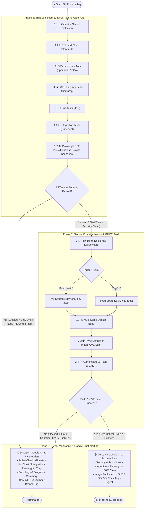

# 🏗️ CI/CD & DevSecOps Pipeline Architecture

## 📌 Overview
This document specifies the technical architecture and workflow logic of the **Continuous Integration (CI) and Secure Container Publishing** pipeline for the `ci-cd-kube` project. The automated pipeline enforces **Shift-Left Security**, a full **Testing Pyramid** (Unit, Integration, and **Playwright E2E browser testing** before any build), Docker multi-stage builds, container vulnerability scanning, **GitHub Container Registry (GHCR)** publication, and real-time **Google Chat** alerting.

*(Note: Kubernetes deployment stages are maintained as a subsequent roadmap milestone).*

---

## 📊 UML Activity Diagram (DevSecOps & Full Testing Pipeline)

---

## 🧪 Testing Pyramid Matrix (All Pre-Build in Phase 1)

| Testing Layer | Framework | Scope & Execution | Why Pre-Build? |
|---|---|---|---|
| **1. 🧪 Unit Tests** | **Jest** | Tests individual functions, utilities, and business calculations in isolation. | Instant feedback (< 5s). |
| **2. 🔄 Integration Tests** | **Supertest / Jest** | Tests HTTP routes (`GET /`, `GET /healthz`), middleware, payload structure, and headers. | Validates API contract before UI testing. |
| **3. 🎭 E2E Browser Tests** | **Playwright** | Launches headless browser (Chromium), executes user journeys, tests DOM rendering & live interactions. | **Fail-Fast**: Stops pipeline before expensive Docker builds if UI flows break. |

---

## 🛡️ Security & Quality Gates Breakdown

1. **🔑 Gitleaks**: Secret detection running on commit diffs before any artifact build.
2. **🧹 ESLint & Prettier**: Enforces syntax quality and static linting rules.
3. **📦 Dependency Audit (SCA)**: Scans third-party packages for known CVEs.
4. **🔍 SAST (Semgrep)**: Static analysis scanning for security anti-patterns (injection, hardcoded configs).
5. **🐳 Hadolint**: Validates Dockerfile against CIS security benchmarks (non-root user, pinned versions).
6. **🛡️ Trivy**: Container vulnerability scanning blocking High/Critical OS and library CVEs.
7. **📢 Google Chat Alerting**: Webhook dispatching rich failure diagnostics with exact error logs and stage name.
