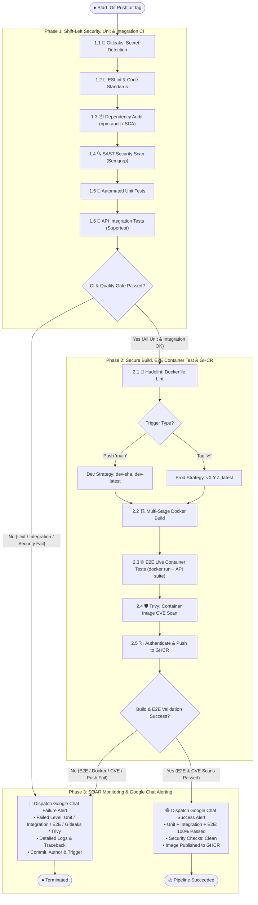

# 🏗️ CI/CD & DevSecOps Pipeline Architecture

## 📌 Overview
This document specifies the technical architecture and workflow logic of the **Continuous Integration (CI) and Secure Container Publishing** pipeline for the `ci-cd-kube` project. The automated pipeline enforces **Shift-Left Security**, a full **Testing Pyramid** (Unit, Integration, and live container E2E tests), Docker multi-stage builds, container vulnerability scanning, **GitHub Container Registry (GHCR)** publication, and real-time **Google Chat** alerting.

*(Note: Kubernetes deployment stages are maintained as a subsequent roadmap milestone).*

---

## 📊 UML Activity Diagram (DevSecOps & Full Testing Pipeline)

---

## 🧪 Comprehensive Testing Pyramid Strategy

### 1. The 3 Testing Levels
| Testing Level | Execution Stage | Scope & Purpose | Tooling |
|---|---|---|---|
| **🧪 1. Unit Testing** | Phase 1 (Pre-Build) | Tests individual modules and pure functions in complete isolation. Fast execution (< 5s). | Jest / Node Test Runner |
| **🔄 2. Integration Testing** | Phase 1 (Pre-Build) | Tests HTTP API endpoints (`GET /`, `GET /healthz`), middleware, error handlers, and payload structures. | Supertest / Jest |
| **🌐 3. E2E / Container Testing** | Phase 2 (Post-Build) | Spins up the newly built Docker image (`docker run -d -p 3000:3000 ...`) and executes end-to-end HTTP requests against the live container to guarantee zero missing runtime dependencies. | Newman / Custom E2E Suite / curl |

---

## 🛡️ Security & Quality Gates Breakdown

1. **🔑 Gitleaks**: Secret detection running on commit diffs before any artifact build.
2. **🧹 ESLint**: Enforces linting standards, static type checks, and formatting rules.
3. **📦 Dependency Audit (SCA)**: Scans third-party packages for known CVEs.
4. **🔍 SAST (Semgrep)**: Static analysis scanning for security anti-patterns (injection, hardcoded configs).
5. **🐳 Hadolint**: Validates Dockerfile against CIS security benchmarks (non-root user, pinned versions).
6. **🛡️ Trivy**: Container vulnerability scanning blocking High/Critical OS and library CVEs.
7. **📢 Google Chat Alerting**: Webhook dispatching rich failure diagnostics with exact error logs and stage name.
