# 🏗️ CI/CD & DevSecOps Pipeline Architecture

## 📌 Overview
This document specifies the technical architecture and workflow logic of the **Continuous Integration (CI) and Secure Container Publishing** pipeline for the `ci-cd-kube` project. The automated pipeline enforces **Shift-Left Security**, environment provisioning, a full **Testing Pyramid** (Unit, Integration, and Playwright E2E), Docker multi-stage builds, container vulnerability scanning, **GitHub Container Registry (GHCR)** publication, and real-time **Google Chat** alerting.

---

## 📊 Complete UML Activity Diagram (Chronological Workflow)

```mermaid
flowchart TD
    StartNode(["● Start: Git Push or Tag"]) --> GHATrigger["Trigger GitHub Actions Runner"]

    subgraph PHASE1 ["Phase 1: Environment Setup, Security & Full Testing Gate (CI)"]
        GHATrigger --> Checkout["1.1 📥 Checkout Code (actions/checkout@v4, fetch-depth: 0)"]
        Checkout --> SecretGate["1.2 🔑 Gitleaks: Scan Commits for Exposed Secrets & Keys"]
        SecretGate --> SetupNode["1.3 ⚙️ Setup Node.js & Cache (actions/setup-node@v4)"]
        SetupNode --> InstallDeps["1.4 📦 Install Clean Dependencies (npm ci)"]
        InstallDeps --> Lint["1.5 🧹 ESLint: Code Standards & Formatting"]
        Lint --> DepAudit["1.6 🛡️ SCA: Dependency Vulnerability Audit (npm audit)"]
        DepAudit --> SAST["1.7 🔍 SAST: Static Code Security Analysis (Semgrep)"]
        SAST --> UnitTests["1.8 🧪 Unit Tests: Pure Functions & Logic (Jest)"]
        UnitTests --> IntegrationTests["1.9 🔄 Integration Tests: HTTP Routes & APIs (Supertest)"]
        IntegrationTests --> PlaywrightE2E["1.10 🎭 Playwright E2E: Headless Browser Scenarios"]
        PlaywrightE2E --> Phase1Dec{"All CI Steps Passed?"}
    end

    subgraph PHASE2 ["Phase 2: Secure Docker Build & GHCR Publishing"]
        Hadolint["2.1 🐳 Hadolint: Dockerfile Security & Best Practice Lint"]
        Hadolint --> SetupBuildx["2.2 🛠️ Setup Docker Buildx & Cache Engine"]
        SetupBuildx --> CheckTrigger{"Trigger Type?"}
        CheckTrigger -->|"Push 'main'"| DevTag["Dev Strategy: dev-sha, dev-latest"]
        CheckTrigger -->|"Tag 'v*'"| ProdTag["Prod Strategy: vX.Y.Z, latest"]
        DevTag --> DockerBuild["2.3 🏗️ Multi-Stage Docker Image Build"]
        ProdTag --> DockerBuild
        DockerBuild --> TrivyScan["2.4 🛡️ Trivy: Container Image CVE Scan"]
        TrivyScan --> PushGHCR["2.5 🏷️ Authenticate with GITHUB_TOKEN & Push to GHCR"]
        PushGHCR --> Phase2Dec{"Build & Push Succeeded?"}
    end

    subgraph PHASE3 ["Phase 3: SOAR Monitoring & Google Chat Alerting"]
        FailAlert["🔴 Dispatch Google Chat Failure Alert<br/>• Exact Offending Step: Gitleaks / Lint / Unit / Integ / Playwright / Hadolint / Trivy<br/>• Failure Logs & Traceback<br/>• Commit SHA, Author & Branch/Tag"] --> TermFail(["● Terminated"])
        SuccAlert["🟢 Dispatch Google Chat Success Alert<br/>• All 10 CI Gates & Tests: 100% Passed<br/>• Image Published to GHCR with Verified Tags<br/>• Commit SHA, Author & Run Link"] --> TermSucc(["◎ Pipeline Succeeded"])
    end

    %% Success Transitions
    Phase1Dec -->|"Yes (All 10 CI Gates Clean)"| Hadolint
    Phase2Dec -->|"Yes (Zero High CVEs & Pushed)"| SuccAlert

    %% Fail-Fast Transitions (Immediate Alert & Terminate)
    Phase1Dec -->|"No (Any Security, Lint, or Test Failure)"| FailAlert
    Phase2Dec -->|"No (Dockerfile Lint, Image CVE, or Push Failure)"| FailAlert
```

---

## 📋 Chronological Step Breakdown

### **Phase 1: Environment Setup, Shift-Left Security & Testing**
1. **`actions/checkout@v4`**: Checks out repository code with `fetch-depth: 0` so Git history is accessible for commit-level secret scanning.
2. **🔑 Gitleaks**: Scans commit history and diffs for leaked secrets, API keys, passwords, and tokens.
3. **`actions/setup-node@v4`**: Installs Node.js 20.x runtime and sets up caching for `~/.npm` to accelerate install times.
4. **`npm ci`**: Installs exact locked dependencies from `package-lock.json`.
5. **🧹 ESLint & Prettier**: Enforces code style, prevents syntax errors, and validates formatting.
6. **🛡️ `npm audit` (SCA)**: Scans installed third-party packages for high/critical vulnerabilities.
7. **🔍 Semgrep (SAST)**: Static code analysis identifying potential security flaws and anti-patterns.
8. **🧪 Unit Tests (Jest)**: Executes unit tests for pure functions and calculations.
9. **🔄 Integration Tests (Supertest)**: Tests API endpoints (`/`, `/healthz`), headers, middleware, and HTTP response codes.
10. **🎭 Playwright E2E Tests**: Launches headless browser instances (Chromium) to execute end-to-end user workflows before any Docker build.

### **Phase 2: Secure Containerization & GHCR Push**
1. **🐳 Hadolint**: Lints `Dockerfile` against CIS security benchmarks (e.g. non-root user, proper instruction order).
2. **`docker/setup-buildx-action`**: Configures Docker Buildx for multi-platform layer caching.
3. **Dynamic Tagging Strategy**:
   - `refs/heads/main` ➔ `dev-<sha>`, `dev-latest`
   - `refs/tags/v*` ➔ SemVer `vX.Y.Z`, `latest`
4. **Multi-Stage Build**: Compiles minimal production image.
5. **🛡️ Trivy Container Scan**: Scans the compiled container image for OS and library CVEs.
6. **GHCR Publication**: Authenticates with `GITHUB_TOKEN` and publishes the image to `ghcr.io`.

### **Phase 3: SOAR Google Chat Webhook**
- Runs on `if: always()`.
- **🟢 Success**: Publishes complete success card with image digest, tag, commit info, and runtime metrics.
- **🔴 Failure**: Pinpoints the exact failing step, extracts error logs, and alerts the developer immediately.
